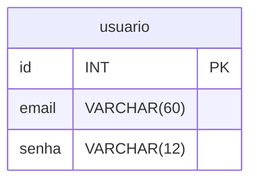

# Mini sistema: Gerenciamento de Alunos.

## CRUD Utilizando HTML + PHP POSTGRESQL

### Objetivos:

### Sistema de login
RF Descrição
1. Tabela usuários

2. Cadastra usuários

3. Criar login

4. Verificar se os usuários são validos em todas as páginas